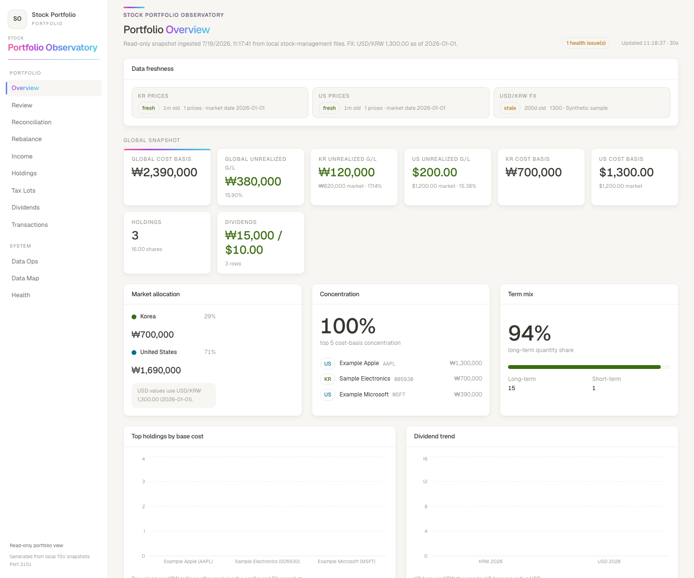
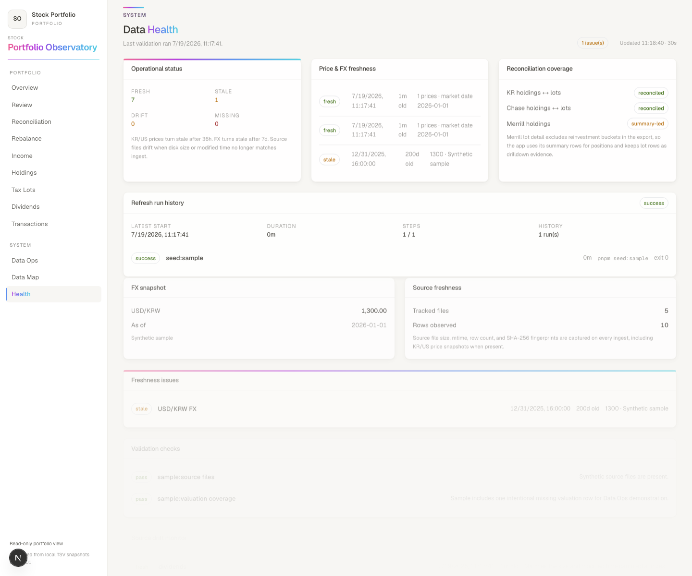
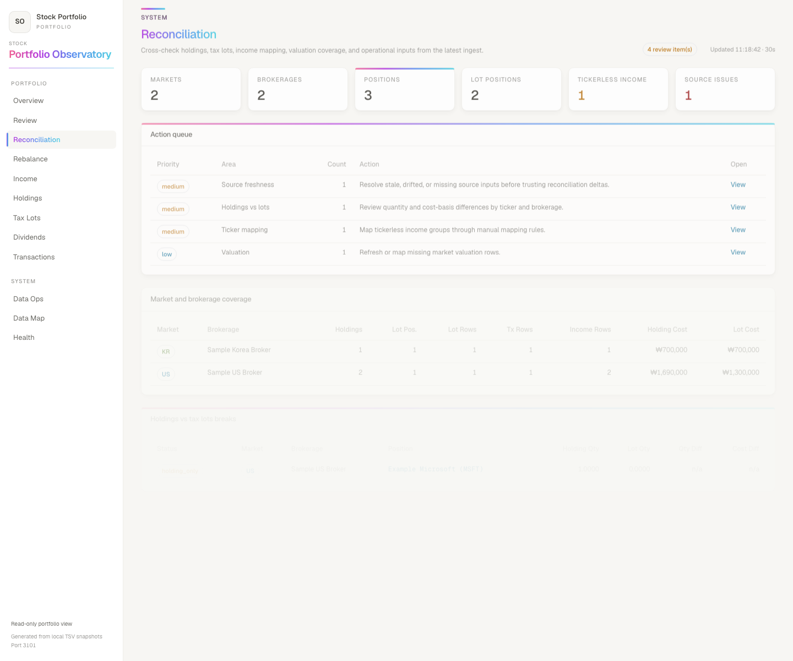
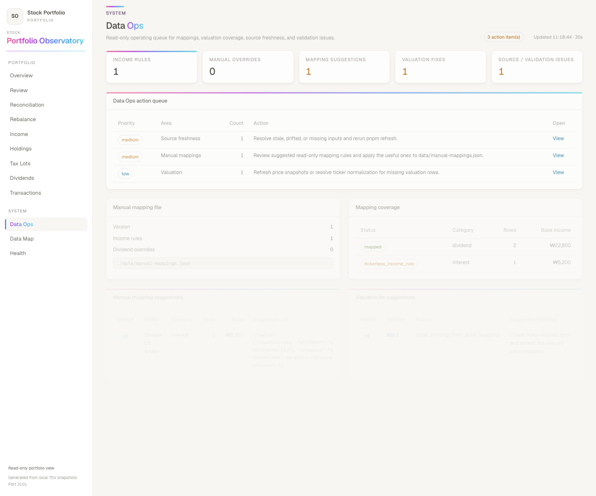
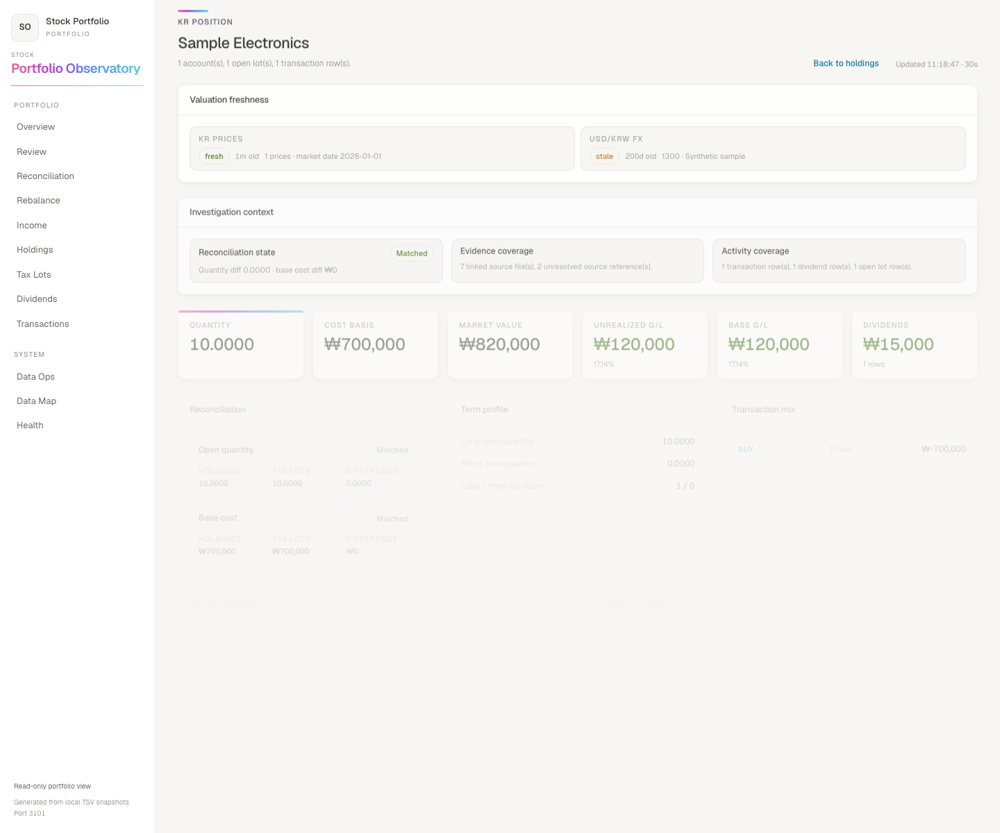

# Stock Portfolio Observatory

Read-only portfolio monitoring dashboard for manually curated stock-management data.

This repository is intended to contain application code only. Real brokerage exports,
tax documents, generated databases, price snapshots, and mapping overrides should stay
outside git or in ignored local files.

## What it does

- Combines Korea and US stock holdings into one read-only portfolio view.
- Preserves native KRW/USD values and converts USD amounts into KRW using an explicit FX snapshot.
- Monitors valuation freshness, source drift, validation checks, and refresh run history.
- Provides operating views for review, rebalancing, income, data ops, reconciliation, source inventory, and position-level investigation.
- Supports a public synthetic sample mode so the app can be evaluated without private brokerage files.

## Sample mode

Use this path to run the public repository without private brokerage data:

```bash
pnpm install
pnpm seed:sample
pnpm dev
```

Local URL: <http://localhost:3101>

`pnpm seed:sample` creates a synthetic SQLite database under `private-data/outputs/stock-portfolio-observatory/` and local ignored sample snapshots under `data/*.json`.

If `.env.local` already exists, `pnpm seed:sample` refuses to run so private-mode runtime snapshots are not overwritten accidentally. Use `SAMPLE_FORCE=1 pnpm seed:sample` only when you intentionally want to refresh local sample files in an existing private workspace.

## Main screens

- `/` - global overview, allocation, largest positions, valuation freshness.
- `/daily-briefing` - archived daily portfolio briefings, one per trading day, with a date picker; session (day-over-day) view above standing-versus-cost.
- `/health` - refresh run history, price/FX freshness, source drift, validation checks, PDF evidence coverage.
- `/data-map` - full source inventory with used, unused, drift, and missing classifications.
- `/reconciliation` - holdings vs tax lots, brokerage coverage, tickerless income, and valuation breaks.
- `/data-ops` - operating action queue with mapping and valuation fix suggestions.
- `/positions/[market]/[ticker]` - position investigation detail with activity timeline, account lot profile, reconciliation state, and source evidence.

## Screenshots

These screenshots use synthetic sample data generated by `pnpm seed:sample`.











## Private operating mode

```bash
pnpm install
cp .env.example .env.local

# Configure STOCK_DATA_DIR and STOCK_DB_PATH in .env.local.
# If your default python3 does not have pdfplumber, set STOCK_PYTHON_BIN.
# Then create local generated-data files from public examples
# (fx-rates.json is fetched by pnpm refresh, not copied):
cp data/manual-mappings.example.json data/manual-mappings.json
cp data/us-pdf-evidence.example.json data/us-pdf-evidence.json
cp data/kr-prices.example.json data/kr-prices.json
cp data/us-prices.example.json data/us-prices.json
cp data/refresh-runs.example.json data/refresh-runs.json

pnpm refresh
pnpm dev
```

## macOS launchd deployment

Production deployments on a private macOS host can run under launchd on port
3101. Keep real brokerage exports, generated databases, and runtime JSON files
outside git or in ignored local files.

**First-time install on the host:**

```bash
make install-service   # build + launchd registration (com.jackpark.stock-observatory, port 3101)
make status / make stop / make logs
```

**Redeploy after code updates:**

```bash
make redeploy          # git pull --ff-only -> pnpm build -> service restart -> status
```

`make redeploy` is the canonical live-update path. `pnpm build` alone only writes
a new `.next/` build; the running `next start` process keeps serving the old build
until launchd is restarted with `make restart` or `make redeploy`.

Use a hostname or private-network address that resolves from the client browser;
SSH aliases are not necessarily browser-resolvable DNS names.

## Data posture

The web app treats `.codex_sheet_payloads/*.tsv` as the current Korea source snapshot and imports supported US brokerage CSV exports into the same normalized SQLite database under `outputs/stock-portfolio-observatory/`. The dashboard never writes back to the source files.

Real source files and generated artifacts are private by default:

- Source exports and PDFs live under `STOCK_DATA_DIR`.
- The generated SQLite database lives at `STOCK_DB_PATH`.
- `data/*.json` runtime snapshots are ignored by git.
- `data/*.example.json` files are synthetic public bootstrapping examples only.

The `/health` page acts as the operating control center: it shows row counts, source file fingerprints, validation checks, price/FX freshness, and source drift risk based on the ingest fingerprint.

## Operating routine

Refresh external valuation inputs before ingesting:

```bash
pnpm refresh
```

`pnpm refresh` runs FX fetch, KR price fetch, US PDF evidence extraction, US price fetch, and ingest in sequence. FX goes first because the ingest converts every native amount with it — a stale rate misstates the portfolio however fresh the prices are. It writes local run history to `data/refresh-runs.json`.

Then open `/health` and confirm that validation checks pass, price/FX snapshots are fresh, source drift is clear, and the latest refresh run succeeded.
Open `/data-ops` when `/health` or `/income` surfaces tickerless rows, missing valuation, stale inputs, or source drift.
Open `/review` after `/health` for the portfolio decision pass: concentration, top gains/losses, short-term exposure, and missing valuation rows.
Open `/rebalance` for the allocation pass: market target gaps, single-position cap checks, reduce candidates, and tax-sensitive watchlists.
Open `/income` for the cashflow pass: trailing income, YTD income, yield on market/cost, monthly trend, top income positions, and tickerless income rows.

## Daily briefing archive

`/daily-briefing` renders the archive written by the separate daily portfolio
briefing pipeline (`stock-portfolio-briefing`, a scheduled job on the same
private host). That pipeline writes one self-contained document per trading day
and publishes the same content to its own gated URL; this page is a second
**read-only** view of the identical files, so the local dashboard and the
published site can never disagree about a date.

- Configure the path with `STOCK_BRIEFING_ARCHIVE_DIR` in `.env.local`. Keep it
  outside git: the documents carry position sizes.
- When the directory is missing the page says so and names the env var, rather
  than failing — a dev checkout without the archive stays usable.
- The documents are already fully derived (rows parsed, aggregates and the
  day-over-day session computed by the writer), so this app implements no
  briefing math of its own and never writes to the archive.
- The page leads with the **session** view — price movement since the previous
  archived snapshot, with trades excluded and reported separately — and keeps
  standing-versus-cost below it.
- US and Korean holdings are rendered as separate blocks, each in its own
  currency with its own thresholds. They are never summed: the briefing carries
  no FX snapshot, so a combined total would be invented.
- Documents predating a field (session, action priority) degrade to an
  explanation rather than an error, and v1 documents — written before the
  markets array existed — are upgraded on read so the archive is never
  orphaned by a schema bump.
- `pnpm seed:sample` creates a synthetic archive so the page renders in sample
  mode and CI.

## Freshness policy

- KR and US price snapshots are considered fresh for 36 hours from their `generatedAt` timestamp.
- FX is considered fresh for 7 days from the configured `asOfDate`.
- Source files are considered drifted when their current disk size or modified time differs from the fingerprint captured at ingest.
- Position detail pages show the relevant price snapshot and FX freshness next to the valuation numbers.

## Manual mapping policy

`data/manual-mappings.json` is the read-only override layer for operational cleanup. The ingest applies mapping rules to normalized rows and records `income_category`, `mapping_status`, and `mapping_note` in the generated database. Source spreadsheets, CSVs, and PDFs are never modified.

- `incomeRules` classify non-position cashflow such as interest, stock lending, and other income.
- `dividendOverrides` can assign ticker/name/category for source rows that need explicit correction.
- `/data-ops` shows the mapping file fingerprint, tickerless income groups, missing valuation rows, and suggested handling.

## Current coverage

- Korea: holdings, tax lots, transactions, dividends, realized lots from `.codex_sheet_payloads`.
- US: Chase holdings/tax lots, Merrill holding summary/tax-lot detail, Robinhood Gain/Loss PDF holdings/tax lots, and Chase/Fidelity/Merrill/Robinhood transactions/dividends.
- Currency: native KRW/USD amounts are preserved separately. USD is also converted to KRW using the configured FX snapshot in `data/fx-rates.json`.
- Prices: KR current prices are stored in `data/kr-prices.json` via `pnpm fetch:kr-prices`; US current prices are stored in `data/us-prices.json` via `pnpm fetch:us-prices`. Brokerage export values are preserved when supplied.
- PDF evidence: US Gain/Loss reports and 1099 PDFs are summarized into `data/us-pdf-evidence.json` via `pnpm extract:us-pdf-evidence`.

## FX policy

`data/fx-rates.json` is the FX source of truth for base-currency conversion. It is a local ignored file, refreshed by `pnpm fetch:fx` (also the first step of `pnpm refresh`) from the same provider as the price snapshots.

It used to be hand-maintained, which meant it was not maintained: the private-mode file sat on the synthetic sample rate (1300) for 203 days while every global KRW figure was understated by ~13%. `/health` flagged it as stale the whole time — a number nobody edits stays stale, so it is fetched now.

- `STOCK_FX_CURRENCIES` (default `USD`) lists the non-base currencies to fetch; `STOCK_BASE_CURRENCY` defaults to `KRW`.
- A partial fetch never overwrites a good snapshot — the step fails instead, so `pnpm refresh` stops rather than ingesting against a half-written rate table.
- Freshness reads the first rate in the file, so the fetched rate leads and the base-to-base identity is appended last (an identity rate is always "current" and would mask a stale real one).
- Rerun `pnpm ingest` after changing rates to regenerate all `base_*` values.

## Tax planning roadmap

The planned tax realization planner should support US-only, Korea-only, and US+Korea filing scenarios without hardcoding those countries into the UI. Local tax assumptions should live in ignored `data/tax-policy.json`, bootstrapped from `data/tax-policy.example.json`.

See [docs/tax-realization-planner.md](docs/tax-realization-planner.md) for the rule model, official-source baseline, manual adjustment design, and implementation stages.

## KR price policy

`data/kr-prices.json` is a read-only external price snapshot generated from the Korea holdings tickers. Run `pnpm fetch:kr-prices && pnpm ingest` to refresh KR market value and unrealized gain/loss without modifying the source spreadsheets.

## US price policy

`data/us-prices.json` is a read-only external price snapshot generated from US holdings tickers. It fills market value and unrealized gain/loss for sources that provide tax lots without current valuation, especially Robinhood Gain/Loss PDFs.

## US PDF evidence policy

`data/us-pdf-evidence.json` is an extracted evidence snapshot for US Gain/Loss and 1099 PDFs. The app fingerprints the source PDFs and shows extraction coverage in `/health`. Robinhood Gain/Loss PDFs feed read-only tax lots and aggregated holdings; 1099 tax forms remain evidence-only until an explicit reconciliation rule is added.

## Public repository hygiene

Before publishing or pushing a new branch, confirm that only code and synthetic examples are tracked:

```bash
git status --short --ignored
rg -n "/Users|BEGIN .*PRIVATE KEY|API[_-]?KEY|SECRET|TOKEN|PASSWORD|1099|Gain_Loss|account_hint" .
```

Do not commit real `data/*.json`, `.env.local`, `private-data/`, `.next/`, `node_modules/`, or generated SQLite files.

## CI

GitHub Actions runs the public sample path on every push and pull request:

```bash
pnpm install --frozen-lockfile
pnpm seed:sample
pnpm typecheck
pnpm build
```

The workflow intentionally uses synthetic sample data only.
